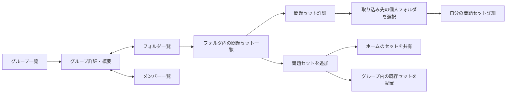

# グループ学習UI

添付の4枚を基準に、React / TypeScriptの既存グループ機能へ反映した仕様。白いカード、淡い背景、青の主要操作、Level0〜3の共通配色を使う。

## 画面と遷移



- 概要を初期タブとする。グループ名、アイコン、人数、フォルダ総数、問題セット総数、全体／自分の進捗、今日のグループ解答ランキング上位3人、フォルダへの導線を表示する。
- フォルダタブはカード一覧。各カードに作成者、セット数、総問題数、セット例3件と残り件数、最終更新、取り込み人数を表示する。空フォルダも保存して表示する。
- フォルダを開くとその中のセット一覧になる。子フォルダとパンくずを表示する。セット詳細から戻ったときは元のフォルダを維持する。
- セット詳細は基本情報、「取り込む」、問題プレビュー3問、取り込んだメンバーの進捗の順。プレビューを開くと全文と選択肢、切り替えると全問を確認できる。タイトル専用フィールドがないため、問題文の先頭行を見出しに使う。
- メンバーは複数人のカード一覧。名前、アバター、今日、今週、取り込みセット数、L3を表示し、今日／今週／L3の降順に切り替える。オーナーにはラベルを付ける。
- 個人の「今日の学習」、最近のアクティビティ、グループ平均進捗、最近追加された問題、セット詳細の権限ラベルは配置しない。
- 「見つける」にも同じフォルダカードとセット詳細を利用する。検索結果が一部しか取得されていないフォルダは「表示中」と明記し、開いた際に全内容を取得する。

## 補完した仕様

| 項目 | 採用したルール |
| --- | --- |
| フォルダ追加 | オーナー／管理者が作成。名前は1〜60文字。既存の階層APIは親・子の2階層を維持する。 |
| セットの追加 | ホームから選ぶと自分のセットを共有し、そのグループのフォルダに配置する。グループから選ぶと既存の参照だけを移動する。 |
| 他人のセット | 管理者はグループ内の配置を整理できる。公開内容、個人フォルダ、他グループの配置は変更しない。一般メンバーは自分の公開セットを配置できる。 |
| 配置数 | 1つのセットは1グループにつき1フォルダ。既存セット追加の確認画面で「このフォルダへ移動します」と表示する。 |
| 取り込み | 個人フォルダを明示的に選び、別のローカルIDでコピーする。既存のコピーは上書きしない。 |
| アイコン | オーナー／管理者がグループ・教材・学習・フォルダの4種類、青・水色・緑・紫の4色から選ぶ。サーバーに保存し、概要／メンバー／グループ一覧で揃える。画像アップロードは今回の範囲に含めない。 |
| 日付 | 今日・今週は全員で日本時間を使う。週は月曜始まり。日付変更・アプリ復帰時に集計を再取得する。 |
| レベル | Level0＝未回答、Level1〜3＝既存の復習レベル。「卒業」はこの4段階表示ではLevel3に含める。色はピンク／黄／緑／水色。 |
| 全体進捗 | 共有を選んだ現メンバーの、同じ現在公開版のコピーを集計。人ごとの割合の平均ではなく、問数を合計して割合を出す。1問を複数人が取り込むと、人数分を対象数に含める。 |
| 自分の進捗 | この端末にある、グループ由来のコピーを集計。公開セットごとに最新の取り込みを1つ採用。古い公開版も、そのコピーの原版として集計する。 |
| 元の問題が編集・削除された場合 | 公開版の対象数は固定。原版と一致しなくなった問題は、この共有集計ではLevel0。自分で加えた問題は対象外。 |
| 割合の丸め | 合計が100%になるよう最大剰余法で整数化。空の対象は割合を捏造せず空状態にする。 |
| 今日・今週の解答数 | 原版と一致した問題への解答ログの件数。繰り返し解答も数える。共有したコピー・セットだけを対象とする。 |
| 未共有・未反映 | 0%や0問に変換せず「—」または状態文言を表示。並び替えでは取得済みの0より後ろに置く。 |
| 人数とセット数 | 取り込み人数はログインしたアカウントの記録を重複除外する。匿名端末は人数に含めない。メンバーの取り込みセット数も同じセット・別端末の重複を除く。既存の公開一覧では端末単位の累計取り込み「件」を使い、人とは区別する。 |

進捗共有は既存のセット単位の同意を維持する。コピーを1つ選んで共有する操作を行ったときに、Level0〜3、今日／今週、対象数、最終反映を送る。個々の回答内容や計画は送らない。学習後はセット詳細の「自分の進捗を反映」で更新する。ランキングとメンバー数値は最終反映時点の値で、自動のリアルタイム集計ではない。

## コンポーネントと状態

| ファイル | 責務 |
| --- | --- |
| `CommunityScreen.tsx` | 認証、グループ選択、セット読み込み、モーダル、公開・配置・取り込み操作 |
| `GroupWorkspace.tsx` | 3タブ、概要、フォルダ内の一覧、メンバーの並び替え |
| `SharedSetDetail.tsx` | セット基本情報、取り込みCTA、プレビュー。進捗は子コンポーネントとして受け取る |
| `GroupLearningUi.tsx` | グループ／メンバーのアバター、フォルダカード、レベルバー、メンバー進捗行 |
| `GroupProgress.tsx` | セット単位の共有状態、同意、集計反映。内容・版・同意世代・アカウントを検証する |
| `useGroupLearning.ts` | 集計の取得、再取得、日付変更、読込中／失敗。グループ・アカウント変更時は古い応答を破棄 |
| `groupLibrary.ts` | 共有フォルダ・配置と旧公開フォルダの表示モデル。元のセットを変更しない |
| `groupLearning.ts` | 原版由来のレベル／解答数集計、問数の合算、割合、メンバーの並び順 |
| `groupLearningService.ts` | API応答の型・検証・取得 |

画面内状態はタブ、フォルダのキー列、全体／自分、並び順、プレビューの展開。API状態は読込中・取得済み・失敗。保存中は操作を無効化し、二重送信を防ぐ。複数セットの一部が失敗した場合はセットごとの結果を残す。公開成功後の端末保存・フォルダ配置失敗も、成功した公開を取り消さず明示する。

## サーバー変更と導入

`supabase/migrations/20261008142626_group_learning_ui.sql` はローカル検証済み。本番DBには未適用。

前提は既存の共有フォルダ、公開版管理、進捗同意のmigrationが適用されていること。今回のmigrationはグループのアイコン、フォルダの作成者・更新日時、進捗のレベル／日・週集計を追加する。旧フォルダのパスは所有者とグループを区別してグループ専用の配置へ移行し、教材の公開パスと内容は維持する。旧クライアントによる進捗更新では新しい集計列を無効化して、古いレベル・解答数を表示しない。

読み書きはアカウント確認済みのRPCを利用する。公開ラッパーはSECURITY INVOKER、内部関数で会員資格・管理者／教材所有者・同意世代・原版を検証する。集計テーブルは既存の非公開schema・RLS・直接アクセス禁止を維持する。新機能のAPIが未導入の場合、画面に準備待ちと再読み込みを表示する。

## ダミーデータと検証

- `tests/fixtures/group-learning.ts`：8メンバー、3フォルダ、6セットのUI用データ。本番画面へは投入しない。
- `tests/browser/group-ui.html`：390／320／768pxの確認用画面。`npm run dev -- --port 5174` で起動し、`/quiz/tests/browser/group-ui.html` を開く。
- `tests/group-learning.test.mjs`：割合、原版の編集・削除・重複、日本時間の境界、並び順、空フォルダ・共有配置。
- `tests/group-learning-rls.test.mjs`：PGlite上でmigrationとRPCを実行し、旧パス移行、同意、公開版更新、未共有、古い集計、配置後の内容・進捗保持、アカウント・ロール制限を確認。
- `tests/browser/group-ui-validation.mjs`：3つの幅でタブ、並び替え、プレビュー、戻り操作、横方向のはみ出しを確認。
- `tests/browser/group-community-validation.mjs`：実際のCommunityScreenを隔離したAPIで動かし、アイコン保存、空フォルダ作成、既存セットの配置、新しいローカルセットの共有を確認。テスト用Viteを5175で起動し、終了時に停止する。実サービスには接続しない。

ブラウザ検証にはPlaywrightとインストール済みChromeを使う。Playwrightがプロジェクト外のランタイムにある場合は、`QUIZMAKE_PLAYWRIGHT_MODULE` にパッケージのディレクトリを指定する。グループ操作検証の実行には通常のTypeScript解決フックも指定する。

```powershell
node --import ./tests/helpers/typescript-imports.mjs tests/browser/group-community-validation.mjs
node tests/browser/group-ui-validation.mjs
npm test
npm run build
```
