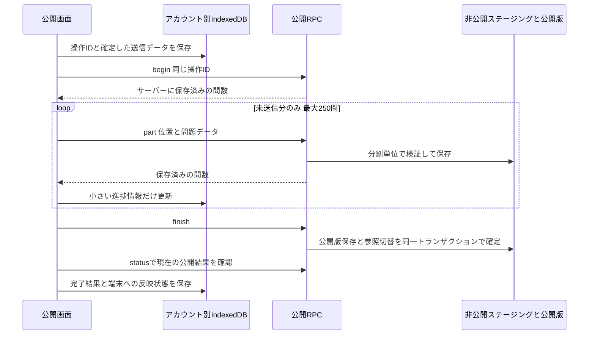

# QuizMake 問題セット公開のタイムアウト修正

問題セットとフォルダの公開を、保存位置から再開できる分割送信に変更した。公開版を一度保存し、既存の公開セットからその版を参照する。全問が揃うまで新しい版を一般利用者に見せない。画面の配色や学習・同期の保存方式は維持する。

2026年10月9日時点で、実装と隔離環境の検証を完了。本番DBへの適用、実データの変更、本番での負荷試験は行っていない。

## 原因と確認範囲

現行の共用Supabaseプロジェクトの関数・トリガー・インデックス・タイムアウト設定を読み取り専用で確認した。リポジトリの公開処理と実DBの定義は以下の点で一致していた。

- `enforce_shared_question_payload_limit` は各問題のINSERT／UPDATEごとに、そのセットの全問題を `SUM(pg_column_size(to_jsonb(...)))` で再走査していた。問数をNとすると処理量がNの二乗に増える。
- `publish_problem_set_versioned` は問題ごとのINSERTに加えて論理IDと内容ハッシュのUPDATEを行っていた。100問の合成テストで、公開版無効化トリガーが300回実行された。容量計算の再走査もこれらの書き込みで繰り返される。
- 公開は1回のRPC／トランザクションで全問を処理する方式だった。`authenticated` と `authenticator` のSQL制限は8秒、旧公開RPCの問題数上限は1,000問だった。
- `shared_questions(set_id, position)` と `shared_problem_sets(owner_id, local_set_id)` のインデックスは存在する。今回確認した主要なボトルネックはインデックス不足ではなく、問題ごとに同じ集合を再走査するSQLだった。
- 画面は一括操作が終わるまで待つ方式で、送信位置と操作IDを永続保存していなかった。

実DBにある同じ関数を隔離したPGliteで動かすと、1,000問の公開に約23.73秒かかった。この再現と8秒制限から、報告されたタイムアウトを説明できる。ただし「英単語-難関」「英単語-発展」の失敗リクエストそのもののトレースは取得しておらず、個別事象への因果関係はこの再現に基づく推定である。

## 公開処理の変更



送信は最大250問かつ512 KiB。サーバーも1パーツ250問／1 MiB以下を検証し、送信済みの前方部分だけを認める。各パーツには内容ハッシュを記録し、同じ操作ID・位置の再送を重複INSERTにしない。通信切断で応答だけを失った場合も、サーバーの保存位置が次回の基準になる。

最終確定はステージングを一度集約し、既存の `quiz_publication_versions` に保存する。`shared_questions` への全問コピー・論理ID更新・ハッシュ更新は新しい公開経路で不要になった。旧行と過去の公開版は残す。読み取りRPCは現在の公開版を直接読むが、版のない旧公開データは従来の行を読む。旧 `publish_problem_set_versioned` も同じ参照方式に更新し、戻り値を維持する。

旧方式のライターには、容量上限のトリガーを親セットのバイト数の差分更新に置き換える。初期値だけ移行時に一度集計し、各書き込みで全問を数え直さない。SQLのタイムアウトは延長しない。

新経路の上限は1セット50,000問かつ8 MiB。説明や画像URLなどが大きければ問数上限より先に容量上限になる。旧・非版管理の `publish_problem_set` は従来の1,000問上限を維持する。今回のアプリは新しい分割RPCを使う。

## 状態と失敗時の動作

| 状況 | 動作 |
| --- | --- |
| 公開待ち | 送信データを端末に保存してから順に開始する。同時刻でも選択順を維持する。 |
| 公開中 | 保存済み問数／全問数を表示。全問送信後は「公開を確定中」と表示する。 |
| 公開完了 | サーバー確定を確認した状態。端末への反映とグループ内配置が失敗した場合は、公開完了を維持して反映だけ再試行する。 |
| 公開失敗 | セット名、利用者向けの説明、再試行できる場合は個別ボタンを表示する。SQLエラーコードなどはログに残す。 |
| タイムアウト／通信断 | 同じリクエストを1回だけ自動再試行し、続けて失敗したら個別再試行を待つ。後続セットは進める。 |
| モーダルを閉じる／画面移動 | 同じアプリ実行中はキューを継続する。モーダル閉鎖を公開取消として扱わない。 |
| アプリ終了／再読み込み | 実行中の状態を端末に残す。同じアカウントで共有画面を開くとサーバーの保存位置から再開する。アプリ終了中に新しい送信を行うバックグラウンドワーカーは追加しない。 |
| 公開取消 | 対応する未完了の公開ジョブを先に中止する。公開停止後の遅い応答を端末に反映しない。 |
| 公開中に設定・版・権限が変わる | 開始時の公開情報との比較と確定時のメンバー資格確認で、変更の上書きを拒否する。完了後も公開情報の更新時刻を確認し、古い結果を反映しない。 |

フォルダは従来どおり複数の独立した問題セットの公開単位。失敗分を除いた完成済みセットは利用できるが、未完成セットの問題は公開しない。失敗した問題セットだけ再試行できる。

Web Locksが使える環境では同一アカウントのタブ間で送信キューを直列化する。DB側も所有者とローカルセットIDの予約ロック、1セット1つの実行中ジョブ、パーツの一意キー、公開情報の比較で重複や競合を防ぐ。RPCの認証・通信待ちは15秒で打ち切り可能にし、1リクエストの通信待ちで後続が止まり続けないようにする。

送信スナップショットとキューはプロジェクト／アカウントの保存領域に分離する。認証は送信時に確認し、アカウントが変わった応答や端末反映を拒否する。学習履歴・進捗・解答ログは公開スナップショットに含めない。完了して端末への反映が済んだスナップショットは退役し、小さい履歴だけを残す。

サーバーの未完了ジョブの期限は30分。別操作に置き換えられていない同じ操作IDは、再開時のbeginで期限を更新できる。新しい操作に置き換わったジョブ、取消済みのジョブ、保存データが変わったジョブは自動で新規公開に作り直さず、公開設定の再確認を求める。

## 権限と互換性

公開フォルダは既存の `folder_path` とセット所有者の組み合わせで識別する。他人が同じフォルダIDを送っても別所有者のフォルダになる。公開フォルダの追加・移動・削除はその作成者のセットに対してだけ実行できる。`move_published_set_folder` と公開取消の所有者確認を維持する。グループ内だけの整理用フォルダは別の機能であり、既存のオーナー／管理者権限を維持する。

共有トークン、公開先の追加、複数グループ、現在版の参照、コピー元の過去版、進捗共有の同意と集計を保持する。同じ内容の再公開では同じ公開版を再利用し、進捗の原版を不用意に変えない。既存の学習データ・同期テーブル・履歴を削除しない。

新しい3テーブルは非公開schemaに置き、RLSを有効化してAPIロールからの直接アクセスを禁止する。公開ラッパーはSECURITY INVOKER、内部関数は所有者・アカウント・グループ資格を確認する。匿名ロールはジョブRPCを実行できない。公開・リンク・グループの読み取り権限は既存条件を維持する。

## 変更ファイル

| ファイル | 変更内容 |
| --- | --- |
| `supabase/migrations/20261008151820_resumable_publication.sql` | 容量カウンター、非公開ジョブ3テーブル、5つの分割RPC、確定と参照による公開、既存RPCの互換対応 |
| `src/utils/publicationPayload.ts` | 学習データを含めない送信データの準備を分離 |
| `src/utils/publicationProtocol.ts` | サイズによる分割、操作ID、ハッシュ、保存位置、再試行、エラー分類 |
| `src/utils/publicationStorage.ts` | アカウント別のキューと不変スナップショット保存 |
| `src/utils/publicationQueue.ts` | 順序維持、後続継続、個別再試行、復元、取消、反映確認 |
| `src/hooks/usePublicationQueue.ts` | 画面を閉じても生存するキューとReact状態の接続 |
| `src/components/PublicationJobs.tsx` | 公開の4状態と問数・再試行ボタン |
| `src/utils/cloudService.ts` | 分割RPC・アカウント確認・通信期限・既存公開関数の対応 |
| `src/screens/CommunityScreen.tsx` と `.css` | 個別／フォルダ公開と一覧の進捗表示。問題を一度セット別に索引化する |
| `tests/publication-queue.test.mjs` | 端末側の復元、再試行、取消、アカウント分離、順序維持 |
| `tests/resumable-publication-sql.test.mjs` と `tests/helpers/publication-db.mjs` | 実SQLによる大量公開、ロール、トランザクション、互換性 |
| `tests/publication-benchmark.mjs` | 旧方式／新方式を同じ合成データで測定 |
| `tests/browser/group-community-preview.tsx` と `group-community-validation.mjs` | 隔離した実画面でフォルダ公開、失敗、閉鎖、再読み込みと再試行 |
| `tests/cloud-random-choices.test.mjs` と `package.json` | 公開ペイロードのテストを分離先に追従し、公開テストを通常の検証に追加 |

同じ作業ツリーにあるグループUIの既存差分は保持している。この公開修正のSQLはグループUI追加SQLに依存せず、2026年10月2日の既存公開版管理schemaを前提とする。

## 性能測定

合成問題のみを使うローカルPGliteで測定した。ネットワーク、Supabaseホストの性能、実データの文章量は含まない。旧方式の計測はSQLの8秒制限を設けず、完了までの計算量を比較した。

| 問数 | 修正前 | 修正後 | 修正後の最大RPC | 分割RPC回数 |
| ---: | ---: | ---: | ---: | ---: |
| 10 | 40 ms | 34 ms | 12 ms | 3 |
| 100 | 282 ms | 33 ms | 25 ms | 3 |
| 1,000 | 23,734 ms | 164 ms | 37 ms | 6 |
| 10,000 | 1,000問上限で拒否 | 1,482 ms | 208 ms | 42 |

修正後の再測定では1,000問164〜219 ms、10,000問1,482〜4,380 msの範囲だった。マシン負荷による差があるため本番の所要時間保証ではない。10,000問の最終確定は直近測定で208 msだった。旧非版管理RPCの容量トリガー改善後も1,000問309 msで完了した。

再実行は以下。出力は `tmp/publication-benchmark-before.json` と `tmp/publication-benchmark-after.json` に保存する。本番接続や実データの投入は行わない。

```powershell
node tests/publication-benchmark.mjs
node tests/publication-benchmark.mjs --after
```

## 検証

`npm test` は635件すべて成功。`npm run build` も成功した。既存のビルドにはチャンクサイズと動的importの警告が残る。公開の異常系ブラウザテストは最終実装で連続2回成功した。

通常の回帰テストに加えて、以下を合成データで検証した。

- 少数、1,001問、10,000問を実SQLで公開し、読み取り件数が一致すること。新経路が共有問題行を複製しないこと。
- 250問保存後の中断・復元、パーツと確定の重複実行、応答喪失後の再試行で公開版が重複しないこと。
- SQLSTATE 57014をパーツ途中で発生させ、ステージングと保存位置がロールバックし、再試行できること。
- 不正な問題、容量超過、不完全な確定で元の完成版が表示され続けること。
- 複数セットの後続継続と失敗分だけの再試行、公開完了後の端末反映失敗、公開取消後の遅い応答を検証すること。
- 公開フォルダの所有者分離、他人の移動・取消拒否、匿名RPC拒否、ステージング直接アクセス拒否。
- 複数グループ、公開先追加、公開中のメンバー資格失効、開始後の公開情報変更、同じ版の公開設定変更を検証すること。
- グループUIのSQLと公開修正SQLを一緒に適用し、再公開後の取り込み履歴、同意、レベル集計とフォルダ配置が維持されること。
- 実際のCommunityScreenでフォルダ一括選択、4状態、モーダル閉鎖、ページ再読み込み、250／600問からの再開と個別再試行を確認すること。APIを全てテスト用に置き換え、実サービスには接続しない。
- 320／390／768pxで既存グループ画面の遷移、並び替え、スクロール、横方向のはみ出しを確認すること。

```powershell
npm test
npm run build
$env:QUIZMAKE_PLAYWRIGHT_MODULE='<Playwrightのパッケージディレクトリ>'
node --import ./tests/helpers/typescript-imports.mjs tests/browser/group-community-validation.mjs
node tests/browser/group-ui-validation.mjs
```

## 本番反映と残る確認

1. 隔離したPostgreSQL／Supabaseステージングで、既存公開版管理schemaと新SQLを適用する。PGliteは単一接続のため、複数の実DB接続によるロック待ち・同時取消・同時公開と、実API経由の認証／通信遅延をここで追加確認する。10,000問は合成データで検証し、本番で負荷試験を行わない。
2. 既存公開セット、版、学習履歴、コピー、公開先、進捗同意の読み取りを新旧クライアントで照合する。DBバックアップと適用先を確認する。
3. `20261008151820_resumable_publication.sql` だけを、検証済みの内容として管理されたmigration手順で適用する。共用プロジェクトのため、手元の全migrationを一括 `db push` しない。以前の履歴にないSQLや他アプリ用DDLを混ぜない。変更は追加の列・テーブル・インデックス・RPCと既存関数の置換で、既存教材の削除を含まない。
4. 新RPCが利用可能になった後、対応するフロントエンドをビルドして配信する。サーバー未更新では公開画面に更新が必要な旨と再試行を表示する。
5. 本番では少数の専用テスト教材で公開・非公開・リンク・フォルダ・複数グループを確認し、RPC所要時間、57014、待機、失敗率を監視する。

ネイティブアプリのOS終了と復帰、実回線での所要時間、複数接続での競合は未測定。端末のIndexedDBが削除された場合のジョブの自動取得や、別端末への送信途中ジョブの移送は今回の範囲に含めない。失効したステージングと小さいジョブ履歴の定期削除は未実装であり、将来の保守時は新しい一時データだけを対象にする。

本番の読み取り専用Advisorでは、公開処理以外にも既存の外部キー索引・RLS評価・公開関数に関する指摘がある。今回のSQLを未適用のため、新オブジェクトの診断結果ではない。隔離環境／適用後に再確認する。非公開テーブルのRLSと直接アクセス拒否はSQLテストで検証済み。

参考：[Supabase RPC](https://supabase.com/docs/guides/database/functions)、[RLS](https://supabase.com/docs/guides/database/postgres/row-level-security)、[外部キー索引の診断](https://supabase.com/docs/guides/database/database-linter?lint=0001_unindexed_foreign_keys)、[RLS評価の診断](https://supabase.com/docs/guides/database/database-linter?lint=0003_auth_rls_initplan)。
